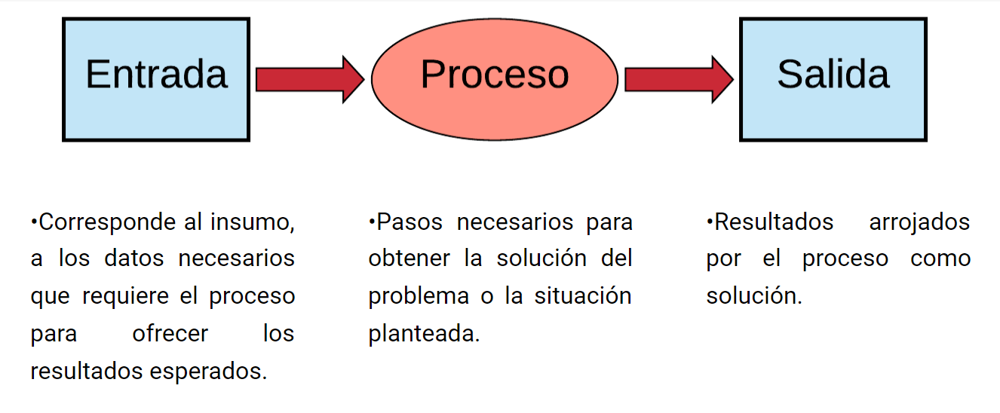

# Introducción

## Preguntas iniciales

* **¿Qué es programar?**

   Programar es dar un conjunto de instrucciones al computador para que este lo ejecute

* **¿Cuál es la finalidad de programar?**

   Simplificar tareas que son más complicadas

* **¿Cuál es el total de sumar todos los números entre 1 y 100?**

   No tengo idea, pero lo puedo averiguar con un programa.

## Algoritmos
Un **problema** es algo que representa una dificultad, una situación que surge cuando existe la necesidad de un cambio positivo.

Un **algoritmo** es un conjunto de pasos, procedimientos o acciones que nos permiten alcanzar un resultado o resolver un *problema*.

### Partes de un algoritmo
1. **Datos de entrada**
2. **Procesamiento de datos**
3. **Datos de salida**

Ilustrado:

Características de un algoritmo:

1. **Precisión**. Los pasos a seguir en el algoritmo se deben detallar con claridad.
2. **Determinismo**. Si los datos de entrada son idénticos, el algoritmo siempre debe generar los mismos resultados.
3. **Finitud**. Independientemente de la complejidad, un algoritmo siempre debe tener un fin.